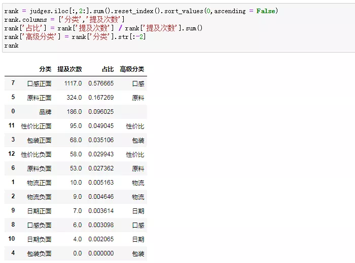
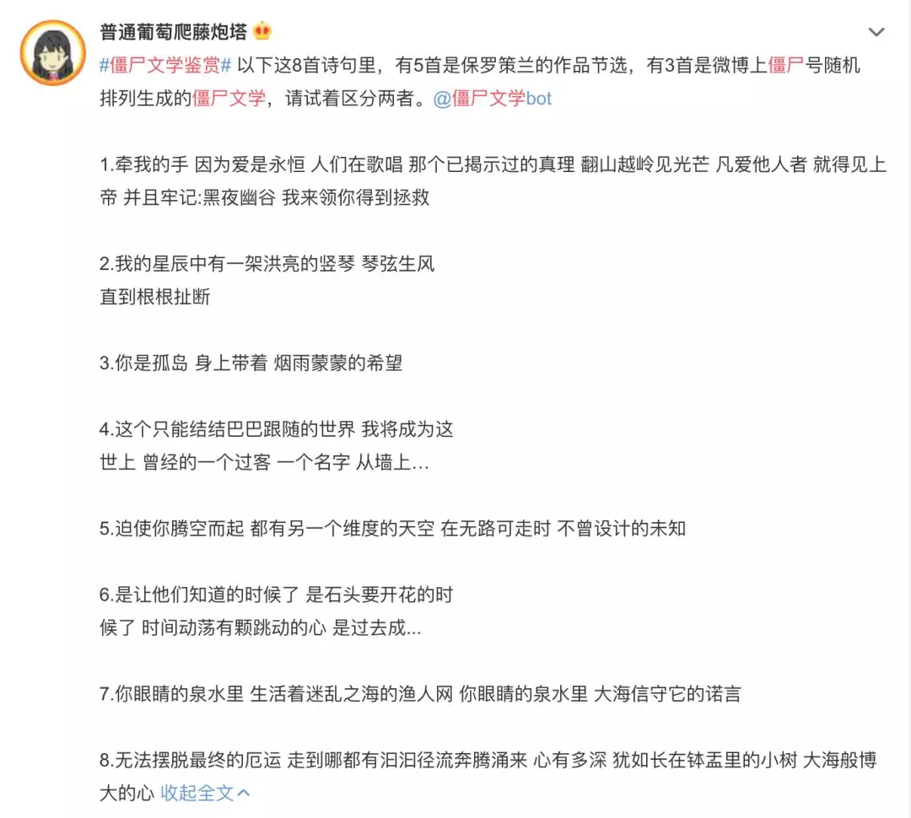
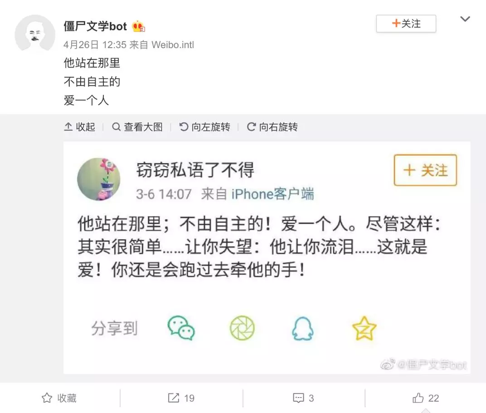

## 用Python多维度分析李子柒做的辣酱


网红带货在近几年开创了一个新的销售渠道，同时由于电商平台的成熟与完善，其中的各类数据都对最终销量有着不同的影响。归根到底，网红带货还是一种引流方式，最终用户是否下单还要基于多种因素考虑。但是当一个用户由于引流视频点击进入了购买页面（排除手滑等非主动因素），说明他在当下是对产品有一定兴趣的。而现在用户最终下单要考虑的因素中，除了价格之外，商品评价也会对用户决策起很重要的影响作用。以下将对一个景点的网红引流商品进行评论数据的分析。

以李子柒在天猫上卖的一款**辣椒酱评价为例**：


### 1. 设立数据分析目标

假设我们是这款辣椒酱的产品负责人，要**基于评价，更好的获悉消费者对产品的看法**，从而为后续产品优化提供思路。

所以，我们的分析目标是**“基于评价反馈，量化消费者感知，指导优化产品”**。


### 2. 目标落地

- **第一步是换位思考：**评价来源于客户，客户对产品有哪些方面的感知呢？我们可以闭上眼睛，幻想自己购买了这款辣椒酱。
- **第二步，基于换位的逻辑拆解**，这里可以按照**模拟购物流程的逻辑来拆解：**
  1. 首先，李子柒本身有非常强的**IP光环**，大家在选购时或多或少是慕名而来。所以，在购买决策时，到底有多大比例是冲着李子柒来的？
  2. 其次，在没收到货前，影响体验的肯定是**物流**，付款到收货用了几天？派送员态度怎么样，送货上门了吗？
  3. 收到货后，使用之前，体感最强的则是**包装**。外包装有没有破损？有没有变形？产品包装是精致还是粗糙？
  4. 接下来是**产品体验**，拿辣椒酱来说，日期是否新鲜？牛肉用户是否喜欢？到底好不好吃？
  5. 吃完之后，我们建立起了对产品的立体感知——**性价比**。我花钱买这个产品到底值不值？这个价位是贵了还是便宜？实惠不实惠？

**品牌、物流、包装、产品（日期、口味）和性价比**五大天王锋芒初现，我们下一步需要量化消费者对于每个方面的感知。

### 3. Python实现

对于评价的拆解和量化，我们先用一种简单粗暴的方式：**按标点把整条评论拆分成零散的模块，再设置一系列预置词来遍历**。

先看看实战爬取的评论数据，一共1794条：


把每条评论按照标点拆分成短句，为了省事，用了简单的正则拆分：


我们发现，就算是比较长段的评论，也只是涉及到**品牌、物流、包装、产品和性价比**的部分方面，所以，我们依次去遍历匹配，看短句中有没有相关的内容，没有就跳过，有的话再判断具体情绪。

以物流为例，当短句中出现“物流”、“快递”、“配送”、“取货”等关键词，大体可以判定这个短句和物流相关。

接着，再在短句中寻找代表情绪的词汇，正面的像“快”、“不错”、“棒”、“满意”、“迅速”；负面的“慢”、“龟速”、“暴力”、“差”等。

在我们预设词的基础上进行两次遍历匹配，大体可以判断这句话是不是和物流相关，以及客户对物流的看法是正面还是负面：


为方便理解，用了灰常丑陋的语法来一对一实现判断。包装、产品和性价比等其他模块的判断，也是沿用上述逻辑，只是在预设词上有所差异，部分代码如下：

```python
def judge_comment(df,result):
    judges = pd.DataFrame(np.zeros(13 * len(df)).reshape(len(df),13), columns = ['品牌','物流正面','物流负面','包装正面','包装负面','原料正面','原料负面','口感正面','口感负面','日期正面','日期负面','性价比正面','性价比负面'])

    for i in range(len(result)):
        words = result[i]
        for word in words:
            #李子柒的产品具有强IP属性，基本都是正面评价，这里不统计情绪，只统计提及次数
            if '李子柒' in word or '子柒' in word or '小柒' in word or '李子七' in word\
                or '小七' in word:
                    judges.iloc[i]['品牌'] = 1

            #先判断是不是物流相关的
            if '物流' in word or '快递' in word or '配送' in word or '取货' in word:
                #再判断是正面还是负面情感
                if '好' in word or '不错' in word or '棒' in word or '满意' in word or '迅速' in word:
                    judges.iloc[i]['物流正面'] = 1
                elif '慢' in word or '龟速' in word or '暴力' in word or '差' in word:
                    judges.iloc[i]['物流负面'] = 1

            #判断是否包装相关
            if '包装' in word or '盒子' in word or '袋子' in word or '外观' in word:
                if '高端' in word or '大气' in word or '还行' in word or '完整' in word or '好' in word or\
                   '严实' in word or '紧' in word:
                    judges.iloc[i]['包装正面'] = 1
                elif  '破' in word or '破损' in word or '瘪' in word or '简陋' in word:
                    judges.iloc[i]['包装负面'] = 1

            #产品
            #产品原料是牛肉为主，且评价大多会提到牛肉，因此我们把这个单独拎出来分析
            if '肉' in word:
                if '大' in word or '多' in word or '足' in word or '香' in word or '才' in word:
                    judges.iloc[i]['原料正面'] = 1
                elif '小' in word or '少' in word or '没' in word:
                    judges.iloc[i]['原料负面'] = 1

            #口感的情绪
            if '口味' in word or '味道' in word or '口感' in word or '吃起来' in word:
                if '不错' in word or '好' in word or '棒' in word or '鲜' in word or\
                    '可以' in word or '喜欢' in word or '符合' in word:
                    judges.iloc[i]['口感正面'] = 1
                elif '不好' in word or '不行' in word or '不鲜' in word or\
                    '太烂' in word:
                    judges.iloc[i]['口感负面'] = 1

            #口感方面，有些是不需要出现前置词，消费者直接评价好吃难吃的，例如：
            if '难吃' in word or '不好吃' in word:
                judges.iloc[i]['口感负面'] = 1
            elif '好吃' in word or '香' in word:
                judges.iloc[i]['口感正面'] = 1

            #日期是不是新鲜
            if '日期' in word or '时间' in word or '保质期' in word:
                if '新鲜' in word:
                    judges.iloc[i]['日期正面'] = 1
                elif '久' in word or '长' in word:
                    judges.iloc[i]['日期负面'] = 1
            elif '过期' in word:
                judges.iloc[i]['日期负面'] = 1

            #性价比
            if '划算' in word or '便宜' in word or '赚了' in word or '囤货' in word or '超值' in word or \
                '太值' in word or '物美价廉' in word or '实惠' in word or '性价比高' in word or '不贵' in word: 
                judges.iloc[i]['性价比正面'] = 1
            elif  '贵' in word or '不值' in word or '亏了' in word or '不划算' in word or '不便宜' in word:
                judges.iloc[i]['性价比负面'] = 1

    final_result = pd.concat([df,judges],axis = 1)

    return final_result
```

运行一下，结果毕现：


第一条评价，很明显的说快递暴力，对应“物流负面”计了一分。

第二条评价，全面夸赞，提到了品牌，和正面的物流、口感信息。

第三条评价，粉丝表白，先说品牌，再夸口感。

看起来还不赖，下面我们对结果数据展开分析。


### 4. 结果分析

我们先对结果做个汇总：



一共爬了1794条评论，评论中有提及到我们关注点的有1937次（之所以用次，是因为一条评论中可能涉及到多个方面）。粗略一瞥，口感和原料占比较高，画个图更细致的看看。


看来，**辣椒酱的口感（好不好吃）是客户最最最关注的点**，没有之一，占比高达57.98%，领先其他类别N个身位。

慢随其后的，是**原料、品牌、性价比和包装**，而物流和日期则鲜有提及，消费者貌似不太关注，或者说目前基本满足要求。

那不同类别正负面评价占比是怎么样的呢？


整体来看，主流评论以好评为主，其中口感、品牌（这个地方其实没有细分）、包装以正面评价占绝对主导。

原料和性价比，负面评价占比分别是14%和38%，而物流和日期由于本身占比太少，参考性不强。

作为一个分析师，我们从原料、性价比负面评价占比中看到了深挖的机会。

原料负面评价是单纯的在吐槽原材料吗？


初步筛选之后，发现事情并没有那么简单。

原料负面评价共出现了53次，但里面有24次给了口感正面的评价，甚至还有8次原料正面评价！罗生门吗？


这8次即正面又负面的原料评价，其实是揭了我们在预置词方面的不严谨，前面判断牛肉相关的短句，“小”就是负面，“大”就是正面，有些绝对。

而判断准确的原料差评中，虽然有一半说味道不错，但还是不留情面的吐槽了**牛肉粒之小，之少**，甚至还有因此觉得被骗。

如何让牛肉粒在体感上获取更多的好评，是**应该在产品传播层做期望控制的宣导？还是在产品层增加牛肉的“肉感”？**需要结合具体业务进一步探究。

性价比呢？


性价比相关负面评价共58次，负面情绪占性价比相关的38%。这些**负面评价消费者大多数认为价格偏贵，不划算**，还有一部分提到了通过直播渠道购买价格相对便宜，但日常价格难以接受。

坦白讲，这款辣酱的价格在线上确实属于高端价位，而价格体系是一个比较复杂的场景，这里暂不展开分析。

但是对于这部分认为性价比不符预期的客户，**是应该因此反推产品价格，还是把他们打上“价格敏感的标签”**，等大促活动唤醒收割，这是两条可以考虑并推进的道路。

物流和日期提及太少，不具备参考性，但为了不那么虎头蛇尾，我们还是顺手看一眼物流负面评价：


果然，物流是一项必备需求，基本满足预期的话消费者并不会主动提及，没达预期则大概率会雷霆震怒。而物流暴力、速度太慢是两个永恒的槽点。

至此，我们基于看起来简单的评价数据，用简单浅白的方式，做了细致的拆分，并通过拆分更进一步的量化和分析，向深渊，哦不，向深入迈进了那么一丢丢。


## 僵尸号文学赏析

社交媒体上的僵尸号竟开始搞创作了。逻辑混乱，但情绪饱满： 

​            

最初，僵尸号的使命很简单：吹大粉丝数，提高账号影响力，于是，人们便取“僵尸”行动简单、数量众多、没有灵魂之义称呼它们。

那时的僵尸号单调且沉默，但随着平台算法日渐严苛，僵尸号们不得不做出改变——伪装成活人。这些赛博拾荒客将四处抓取的文字、图片拼接在一起，装点自己的首页。

笨拙、荒诞，再加一点浪漫，僵尸文学就这样诞生了。

**而你不知道的是，这些乍看逻辑混乱、颇有人工智障气质的离谱家伙，早已为它们背后的人创造了可观的财富。**


### 1. 僵尸文学大赏

最早让我注意到僵尸文学的，是微博上的一则挑战，挑战者需要在8首诗中分别辨认出德国诗人保罗·策兰和僵尸号的作品。 

​       

 我自信满满地在内心里提交了答案，直到博主公布的那一刻，我才知道自己输得一塌糊涂。

稍做功课后，我发现，这些随机的文字碎片拼接起来，反而充满了超现实的审美趣味，一个又一个僵尸号竟成了中文互联网崭新的浪漫金矿。

这不只是猎奇，还是一场赛博寻宝运动。在僵尸号创作的庞大海洋里，每个人都能找到触动自己的诗意碎片： 

​                                   

但大部分情况下，它们的内容是混乱的，时而歇斯底里地狂飙垃圾话，时而发梦般喃喃自语，这些发言看似荒诞却异常魔性，好像暗藏什么了不得的启示，像极了某些人写的现代诗：

​                                                              

它们总能给你惊喜，甚至还会cosplay狗粉丝： 

​       

此外，魔幻惊悚题材也必须安排，看看下面这张图，好像在暗示食人魔主题的B级片，恐怖指数直接拉满： 

​               

当然，荒诞混乱还是文艺界常见的套路。下面这条日本都市传说碰瓷中国神仙，其想象力不亚于 《孙悟空大战奥特曼》。 

​       

渐渐地，本来被造出来做别人粉丝的僵尸号们竟有了自己的粉丝，爱好者们乐此不疲地在互联网上寻找新的僵尸文学，并将其投稿分享。

而有时，他们也会按捺不住自己的创作欲、尝试打破活人和僵尸间的边界，开展僵尸文学cosplay大赛，表现出众者则会被尊称为“带尸人”。 

​            

甚至还有人总结了一整套“僵尸创作方法论”：文字力求乱中有序，标点最好用错几个，头像必须又糊又土。

由此可见，僵尸文学的学问远不止文字，它是一门多媒体复合艺术、一场互联网文化动员，是流量时代特有的风景线。

**然而，往更深了挖，僵尸文学只是僵尸号生态表层的一面，在这些僵尸看似无序的行为背后，则隐藏着悄悄运作了数年的金钱密码。**


### 2. 僵尸文学从何而生

透过任何一门生意你都能看到人性的漏洞，灰色产业尤甚。

社交媒体版的马太效应是：粉丝多者粉丝愈多、影响力愈大，相应的，其他人的发声空间就会缩小。

因此，任何想要闯出名声的人都不会容忍自己在平台上“被折叠”，他们自然而然地去寻求扩大粉丝量的手段，就和你小时候哭着闹着要买合体玩具一个道理：**不怕大家都没有，就怕别人有我没有。**

影响力带来的甜头不止马斯洛金字塔尖儿那点自我实现，做得好就能有饭恰，你激动不激动？

当然，抛开商业原理空谈人性漏洞纯属耍流氓，僵尸号产业能盈利，还是因为它被纳入了更大的资本运作中，搭上了平台流量变现的顺风车。

以微博为例。

查看微博盈利结构，可以发现其最核心的渠道就是广告，而影响广告主决策的最直接标准正是流量数据，这里，自然是僵尸号们发光发热的地方。 

​       

<center>2019Q2微博业绩，可以看出广告明显占据大头</center>

为了进一步摸清僵尸粉的运作模式，我亲自找到了一家僵尸号店铺，和他们的客服聊了聊：

这家店是典型的小作坊，但不妨碍我们从它切入，一探僵尸号工厂的业务模式：

微博、微信、百度问答应有尽有，不过这家交易量最大的服务，还是微博加粉。


由于马上要辞职了，客服小哥不嫌麻烦，陪我唠了会儿嗑。

首先，也是最重要的：定价问题。

这牵扯到僵尸粉的质量，由于各家生产的方式不同，也有着不同标准：活跃度、牢固度、是否自带粉丝、能否能够互动，等等等等……

但最核心在于：僵尸粉能否像活人一样，或者说，（在平台识别面前）僵尸粉能否被认作活人。

这家店的粉丝业务分为普通粉、高级粉、超级粉、超级达人粉，反正这类头衔的命名逻辑基本上和游戏里的段位差不多，价格也相应地从低到高往上涨。

给大家个价位表自行体验下什么水平：

       

那么，这些粉丝是怎么来的呢？

最低级的僵尸粉是早期依靠新浪微博的接口漏洞凭空产出的，它们只能进行关注的操作，无法转评赞，头像和首页更是一片空白，名副其实的僵尸，除了多没有任何优势，也卖不出什么好价钱。

而那些所谓的高级粉、超级粉的生产流程更加复杂：一是盗取废弃账号，二是盗用身份，利用爬虫软件批量抓取用户的真实信息，再生产出一个僵尸版的用户，这样的账户会发内容、有真人头像，在平台的算法眼里，它和真人账户没有区别。

这些高级粉通过专门的养号机器进行维护，在程序的指导下，它们会定时转发、评论、点赞，同时还会四处抓取随机的文字和图片充实自己的首页。

**而这，也是所谓僵尸文学的由来。** 

​            

聊着聊着，我突然想到一个扎心的问题：卖僵尸粉能挣多少钱呢？

小哥告诉我：僵尸号的生意，说到底其实也是一个走量的活儿。同一个老板名下有几十家店铺，分别投放到不同的平台。**如果把老板的所有店铺加在一起，是年入百万的水平。**

由于这些粉丝会脱落，所以，开启了买粉之路就要做好打持久战的准备，为了避免被抓住把柄，大部分买家都会尽量扩展自己的购买渠道，所以专营一家店铺的收益远低于用多家店铺覆盖市场。

问完了盈利状况，我又问起了目标群体。

除了明星网红和他们的背后团队，来买僵尸粉的主要是两种人，他们组成这门生意的长尾市场：

**一种是被绩效KPI压得喘不过气的新媒体小编、企业宣发**，对于他们来说，花钱刷数据是为了抚慰自己无处安放的才华，更是破财消灾，躲过老板斥责的不二法门。

**而另一种则是饭圈女孩**，“艹数据”是衡量对哥哥热爱的量化指标，因此他们成了这些僵尸粉作坊的大客户群。作为物美价廉、便于获取的黑科技，这些刷量工具被饭圈女孩在自己的社群里孜孜不倦地分享给战友们。 


<center>饭圈女孩的养号教程</center>

在与从业者聊过之后，我大致了解僵尸粉产业的运作逻辑。大资本吃肉，小作坊喝汤。

他们绝对料不到，自己拿来赚钱的工具居然承载了别样的文化趣味，如果说拼多多文学是平台自主破局的有意之举，那么僵尸文学则是无心插柳的产物。

有人说，他们从“僵尸”身上看到了自己的影子——对大环境一无所知、兢兢业业工作、却留下很少的痕迹，纷纷感概找到了赛博难兄难弟、web3.0版工具人。 

​            

更有人认为，僵尸文学最大的张力并不是机器人与诗人身份的对立，而是它们的内容就像每个平凡人的生命一样野生而多元。

人们对僵尸文学的解读千差万别，僵尸号载入当代文学史指日可待。

不可否认，僵尸文学的确很浪漫，这些参差多态的表象拥有相同的审美内核，它告诉着我们：

***“资本世界的浪漫真理只有一条，那就是钱。”*** 


